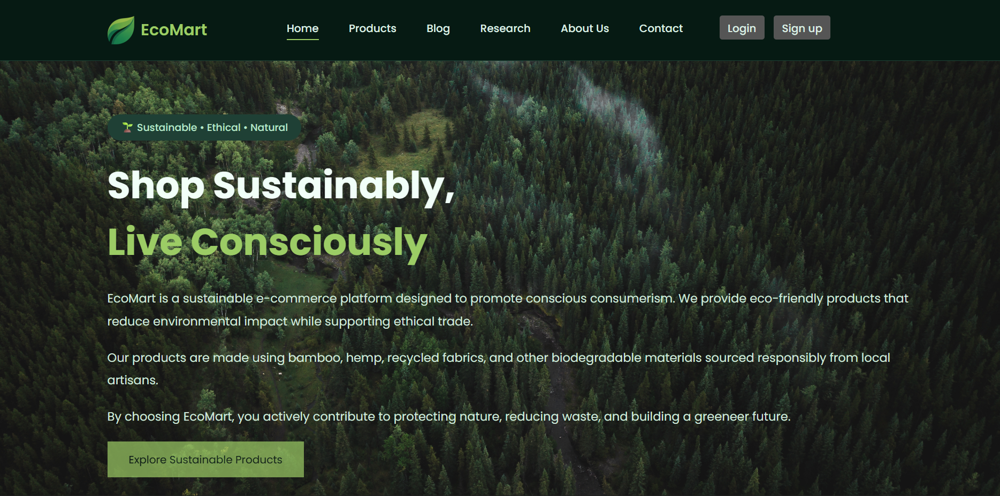

# EcoMart 🌱

A sustainable e-commerce website that promotes eco-friendly living through ethically sourced and environmentally conscious products.



## 🌍 About

EcoMart is a modern e-commerce platform designed to encourage sustainable shopping habits. The website showcases eco-friendly products such as organic cotton bags, bamboo cutlery, reusable household items, and other environmentally responsible alternatives.

The project focuses on creating an engaging user experience while spreading awareness about sustainable consumer choices.

## ✨ Features

* Responsive and modern design
* Sustainable product catalog
* Interactive navigation
* Product showcase section
* Research and blog pages
* Contact and About Us pages
* Eco-friendly branding and theme

## 🛠️ Built With

* HTML5
* CSS3
* JavaScript

## 📂 Project Structure

```text
EcoMart/
├── assets/
├── css/
├── html/
├── index.html
└── preview.png
```

## 🚀 Getting Started

1. Clone the repository:

```bash
git clone https://github.com/raunak77711/ecomart.git
```

2. Open `index.html` in your browser.

## 🎯 Mission

To inspire conscious consumerism by providing a platform that highlights sustainable, ethical, and environmentally friendly products.

## 👨‍💻 Author

**raunak and co**

---

🌿 *Shop Sustainably, Live Consciously.*
